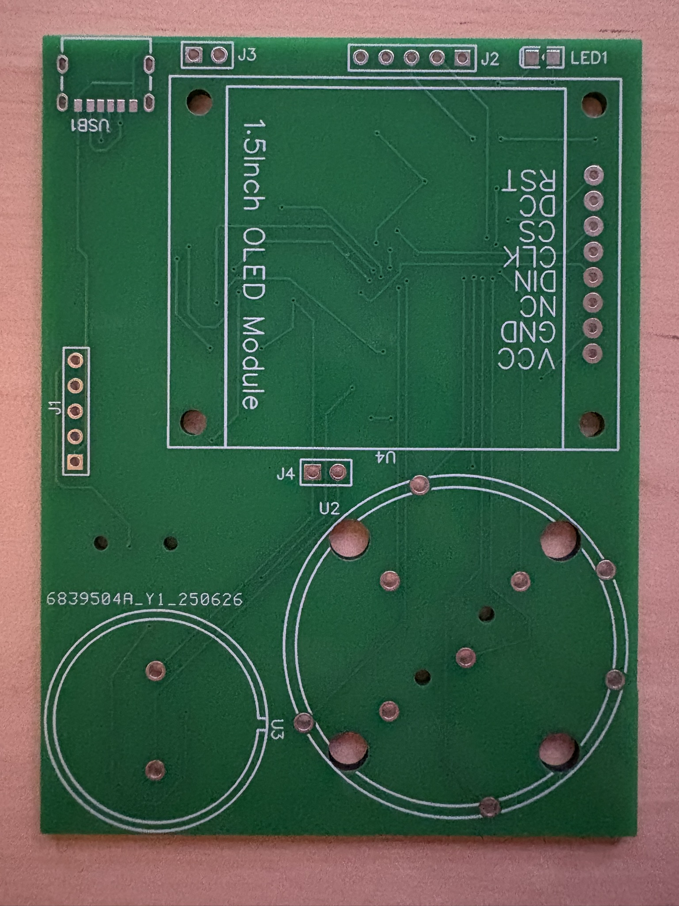
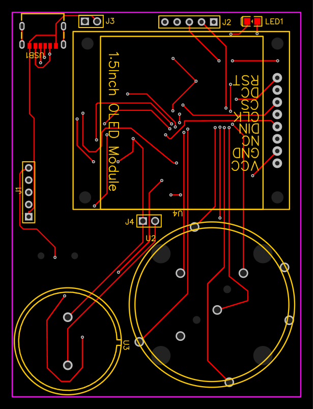
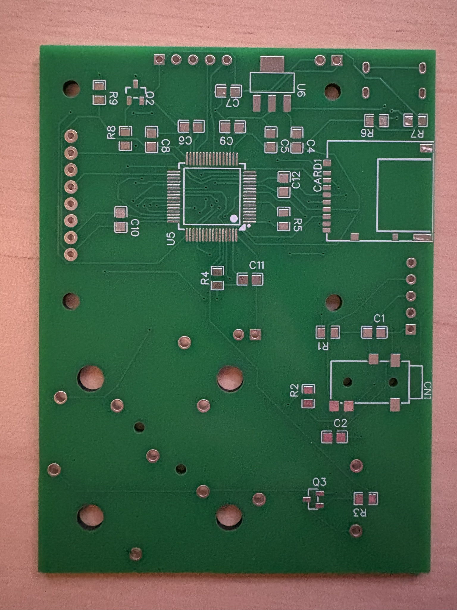
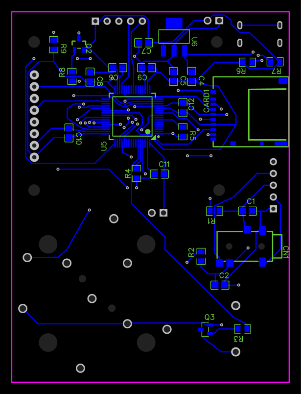

# This repo showcases my skills and knowledge of
- Continious Integration/Continious Deployment (Github actions)
- Linting Tools (Clang-format)
- Static Analysis Tools (Clang Tidy, Sonar Qube)
- Unit Test Code Coverage Tools (lcov)
- Unit Tests (Test Driven Development, gtest, mocking)
- Github pages to show code coverage report (https://hitthesurf.github.io/music_player/)
- Dev Containers
- Bare Matel Programming on STM32 (Simple GPIO)
- ThreadX (Azure Rtos) (Basic multi threading concepts queues)
- FileX
- Using STMCLT
- Communication Protocols using HAL (uart, spi (Todo), SDMMC (DMA based))
- C/C++
- python
- bash (scripts for github actions)
- cmake
- cmake presets
- UML (Used for rough working of interfaces) 
- Unit Test Bare Metal, Unit test HAL
- Parsing binary files (.Wave files)

# Project Features
- Can stream wave files from micro SD card to internal RAM via DMA
- Can decode a wave file and play the required amplitude via pwm output
- Can stop, start music via uart terra term command line

# Rev 1 HardWare

[View Music Player Rev1 Schematic PDF](docs/Schematic_Music-Player-Rev1.pdf)

| Front Real PCB | Front Virtual PCB |
|--------|--------|
|  |  |

| Back Real PCB |  Back Virtual PCB|
|--------|--------|
|  |  |

# Project Video Demo
[▶️ Watch Demo Video on Vimeo](https://vimeo.com/1093545290/fb03e3207f?ts=0&share=copy)

# Fixes needed
- The unit test run does not wait for the docker action to be finished building.
